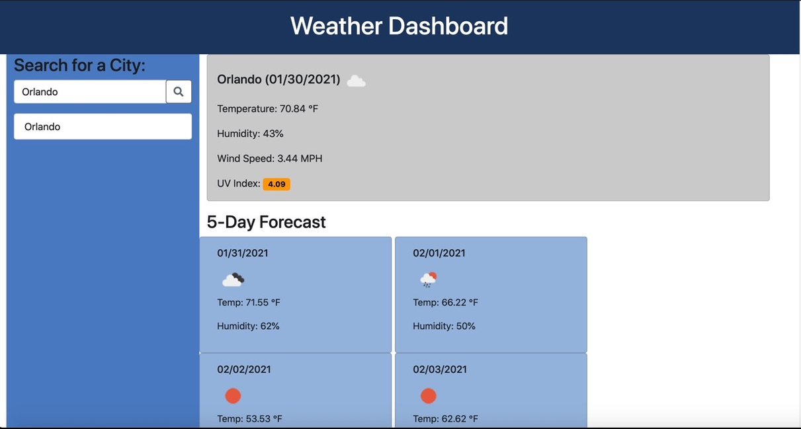

# Weather_Dashboard

Welcome to the weather dashboard. With this app, you can input a city and see today's weather, wind speed, UV Index, and humidity. It also will give you the icon if it is sunny or cloudy or even raining. Also, it shows the weather for the next 5 days so that you can plan accordingly. Give it a shot.

<https://github.com/rroman6292/Weather_Dashboard>

<https://rroman6292.github.io/Weather_Dashboard/index.html>
